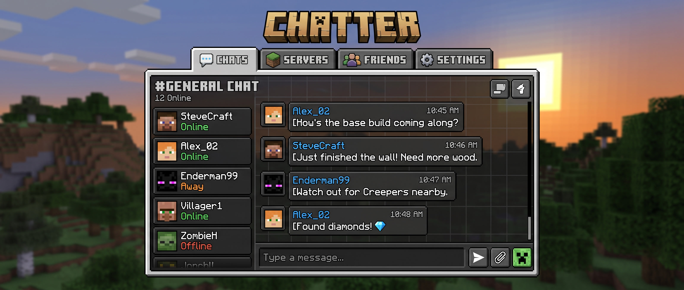

# Chatter



> A private group-messaging app with a Django REST Framework backend and a native Android client.

[](#)
[](#license)
[](#backend-backend)
[-3DDC84.svg)](#mobile-client-mobile)

Chatter lets users exchange private text messages, photos, videos, and voice notes inside groups they own or are invited to. It uses a simple polling-based delivery model (30-second interval) and a clear two-tier admin model so group owners stay in control.

## Table of Contents

- [Features](#features)
- [Architecture](#architecture)
- [Repository Structure](#repository-structure)
- [Tech Stack](#tech-stack)
- [Getting Started](#getting-started)
  - [Prerequisites](#prerequisites)
  - [Backend (`/backend`)](#backend-backend)
  - [Mobile Client (`/mobile`)](#mobile-client-mobile)
  - [Docker Compose](#docker-compose)
- [API Overview](#api-overview)
- [Roles & Permissions](#roles--permissions)
- [Roadmap](#roadmap)
- [Contributing](#contributing)
- [License](#license)

## Features

- Private 1:1 and group text messaging.
- Every new user automatically gets a personal group where they are admin.
- Any user can create groups; the creator becomes the **head admin**.
- Group admins can invite and kick members, and promote members to admin.
- **Head admins** can additionally permanently ban users from a group.
- Send **images**, **videos**, and **voice messages** in addition to text.
- Message delivery via polling at a 30-second interval (no websockets required).
- Backend serves both **WSGI** (gunicorn) and **ASGI** (daphne).

## Architecture

```
┌──────────────────────┐         HTTPS / JSON         ┌──────────────────────────┐
│  Android client      │  ───── REST (Retrofit) ────▶ │  Django + DRF backend    │
│  (/mobile)           │  ◀──── 30s polling ───────── │  (/backend)              │
│                      │                              │  • WSGI: gunicorn        │
│  Kotlin + Retrofit   │                              │  • ASGI: daphne          │
│  ExoPlayer / Media3  │                              │  • SQLite database       │
└──────────────────────┘                              │  • Local media storage   │
                                                      └──────────────────────────┘
```

A monorepo houses both projects so changes to the API contract and the client can land in a single, atomic commit.

## Repository Structure

```
chatter/
├── backend/      # Django + DRF project (WSGI gunicorn, ASGI daphne, SQLite)
├── mobile/       # Android Studio project (Kotlin)
├── docs/         # Implementation plan and design notes
│   ├── IMPLEMENTATION.md
│   └── notes.md
└── README.md
```

## Tech Stack

**Backend**

- Python 3.11+
- Django 5.x, Django REST Framework
- gunicorn (WSGI) + daphne (ASGI)
- SQLite

**Mobile**

- Kotlin, min SDK 24
- Retrofit + OkHttp + Moshi
- Coroutines + Flow, Hilt, Room
- Media3 / ExoPlayer for video, `MediaRecorder` for voice, Coil for images

## Getting Started

### Prerequisites

- Python 3.11+ and `pip`
- Android Studio (Hedgehog or newer) with an Android SDK that supports API 24+
- Docker and Docker Compose (optional, for the dual-server setup)

### Backend (`/backend`)

```bash
cd backend
python -m venv .venv
source .venv/bin/activate          # Windows: .venv\Scripts\activate
pip install -r requirements.txt
python manage.py migrate
python manage.py createsuperuser
python manage.py runserver 0.0.0.0:8000
```

For a production-like setup running both servers:

```bash
gunicorn chatter.wsgi:application --bind 0.0.0.0:8000
daphne   chatter.asgi:application --bind 0.0.0.0:8001
```

### Mobile Client (`/mobile`)

1. Open the `/mobile` directory in Android Studio.
2. In `local.properties`, set the backend base URL:
   ```
   BASE_URL=http://10.0.2.2:8000/
   ```
   (`10.0.2.2` is the Android emulator's alias for the host machine's `localhost`.)
3. Run the `app` configuration on an emulator or a connected device.

### Docker Compose

The `docker-compose.yml` at the repo root spins up gunicorn, daphne, and an nginx reverse proxy:

```bash
docker compose up --build
```

The API is then reachable at `http://localhost:8080/` via nginx on the host machine. The internal Django app remains on `http://localhost:8000/` when accessed directly from the Docker network.

## API Overview

| Method | Path                                       | Purpose                              |
| ------ | ------------------------------------------ | ------------------------------------ |
| POST   | `/api/auth/register/`                      | Create an account                    |
| POST   | `/api/auth/login/`                         | Obtain an auth token                 |
| GET    | `/api/groups/`                             | List groups the user belongs to      |
| POST   | `/api/groups/`                             | Create a group (creator = head admin) |
| POST   | `/api/groups/{id}/invitations/`            | Invite a user (admin+)               |
| POST   | `/api/groups/{id}/members/{user}/kick/`    | Kick a member (admin+)               |
| POST   | `/api/groups/{id}/members/{user}/promote/` | Promote to admin (admin+)            |
| POST   | `/api/groups/{id}/members/{user}/ban/`     | Permanently ban (head admin only)    |
| GET    | `/api/groups/{id}/messages/?since=<iso>`   | Poll for new messages                |
| POST   | `/api/groups/{id}/messages/`               | Send text and/or media (multipart)   |

Authenticated requests must include `Authorization: Token <token>`.

The full surface and design rationale are in [docs/IMPLEMENTATION.md](docs/IMPLEMENTATION.md).

## Roles & Permissions

| Action                          | Member | Admin | Head Admin |
| ------------------------------- | :----: | :---: | :--------: |
| Read messages                   |   ✓    |   ✓   |     ✓      |
| Send messages                   |   ✓    |   ✓   |     ✓      |
| Invite users                    |        |   ✓   |     ✓      |
| Kick users                      |        |   ✓   |     ✓      |
| Promote users to admin          |        |   ✓   |     ✓      |
| Permanently ban users           |        |       |     ✓      |

## Roadmap

- [ ] Auth + custom user model
- [ ] Groups, memberships, invitations
- [ ] Admin / head-admin permissions and bans
- [ ] Text messages with `since` polling
- [ ] Image, video, and voice attachments
- [ ] gunicorn + daphne dual-server config
- [ ] Android client end-to-end

See [docs/IMPLEMENTATION.md](docs/IMPLEMENTATION.md) for the full plan.

## Contributing

1. Create a feature branch from `main`.
2. Make focused changes and add tests where applicable.
3. Open a pull request; CI must pass before merge.

We follow trunk-based development: keep branches short-lived and merge often.

## License

License TBD.
